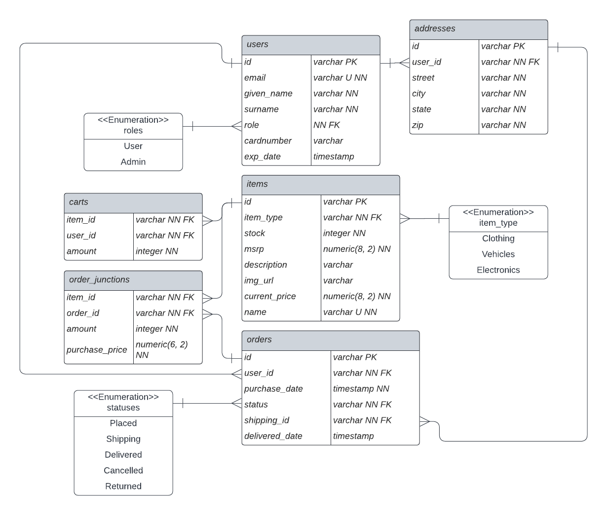

# StarMax

## Description

An online marketplace for all your interstellar travel needs.
Full stack, React and Spring, ecommerce project with full CRUD functionality.

## Tech Stack

## Frontend

- [TypeScript](https://www.typescriptlang.org/)
  - "strongly typed programming language that builds on JavaScript"
- [React](https://reactjs.org/)
  - "A JavaScript library for building user interfaces"
- [Create React App](https://create-react-app.dev/)
  - For bootstrapping the build process
- [React Router Dom](https://reactrouter.com/en/main)
  - For client side routing
- [Axios](https://axios-http.com/docs/intro)
  - "promise-based HTTP Client for node.js and the browser"
- [Tailwind](https://tailwindcss.com/)
  - "utility-first CSS framework"
- [heroicons](https://github.com/tailwindlabs/heroicons#readme)
  - "Beautiful hand-crafted SVG icons, by the makers of Tailwind CSS"

## Backend

- [Java 8](https://www.oracle.com/java/technologies/java8.html)
  - "Java 8 is a revolutionary release of the world’s #1 development platform."
- [Apache Maven](https://maven.apache.org/)
  - "Apache Maven is a software project management and comprehension tool."
- [PostgreSQL](https://www.postgresql.org/docs/current/index.html)
  - Robust, reliable, database
- [Spring](https://spring.io/)
  - "Spring’s focus on speed, simplicity, and productivity has made it the world's most popular Java framework."
- [JSON Web Tokens](https://jwt.io/)
  - "JSON Web Tokens are an open, industry standard RFC 7519 method for representing claims securely between two parties."
- [JUnit](https://junit.org)
  - "JUnit is a simple framework to write repeatable tests."
- [Mockito](https://site.mockito.org/)
  - "Tasty mocking framework for unit tests in Java"

# Workflow

- `git checkout -b feature-branch`
- get the feature working
- test your feature
- squash commits if more than one with interactive rebase 
  - check how many commits to squash with `git log`
  - `git rebase -i HEAD~[X]` (X number of commits to squash)
- `git push` the branch up to the remote repo
- create a PR on Github

# Schema

# Getting Started with Create React App

This project was bootstrapped with [Create React App](https://github.com/facebook/create-react-app).

## Available Scripts

In the project directory, you can run:

### `npm start`

Runs the app in the development mode.\
Open [http://localhost:3000](http://localhost:3000) to view it in the browser.

The page will reload if you make edits.\
You will also see any lint errors in the console.

### `npm test`

Launches the test runner in the interactive watch mode.\
See the section about [running tests](https://facebook.github.io/create-react-app/docs/running-tests) for more information.

### `npm run build`

Builds the app for production to the `build` folder.\
It correctly bundles React in production mode and optimizes the build for the best performance.

The build is minified and the filenames include the hashes.\
Your app is ready to be deployed!

See the section about [deployment](https://facebook.github.io/create-react-app/docs/deployment) for more information.

### `npm run eject`

**Note: this is a one-way operation. Once you `eject`, you can’t go back!**

If you aren’t satisfied with the build tool and configuration choices, you can `eject` at any time. This command will remove the single build dependency from your project.

Instead, it will copy all the configuration files and the transitive dependencies (webpack, Babel, ESLint, etc) right into your project so you have full control over them. All of the commands except `eject` will still work, but they will point to the copied scripts so you can tweak them. At this point you’re on your own.

You don’t have to ever use `eject`. The curated feature set is suitable for small and middle deployments, and you shouldn’t feel obligated to use this feature. However we understand that this tool wouldn’t be useful if you couldn’t customize it when you are ready for it.

## Learn More

You can learn more in the [Create React App documentation](https://facebook.github.io/create-react-app/docs/getting-started).

To learn React, check out the [React documentation](https://reactjs.org/).
